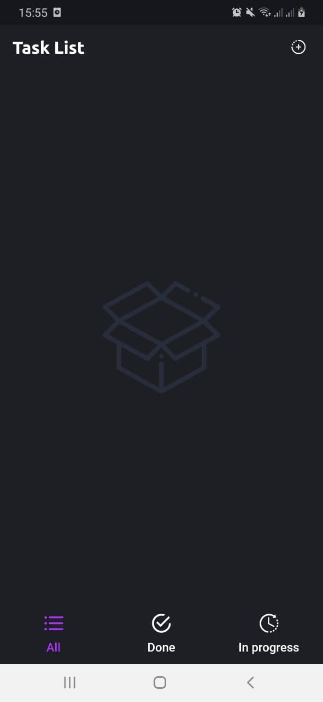
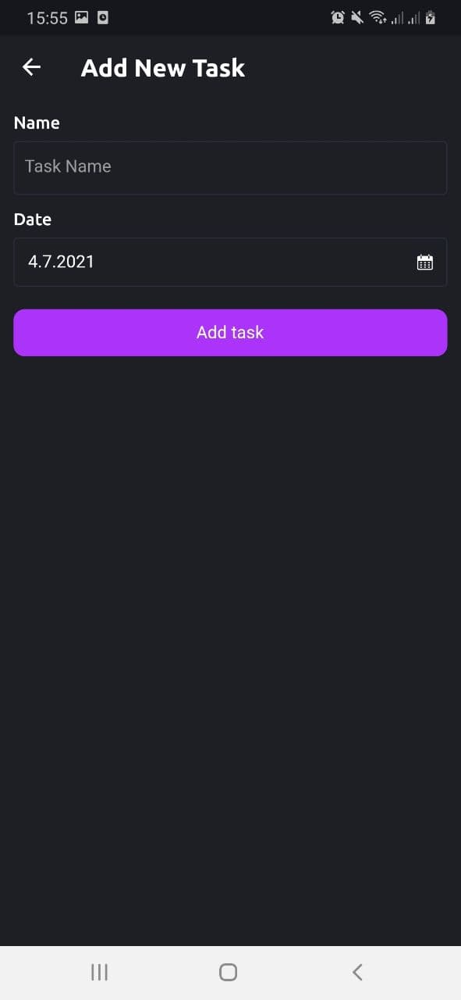
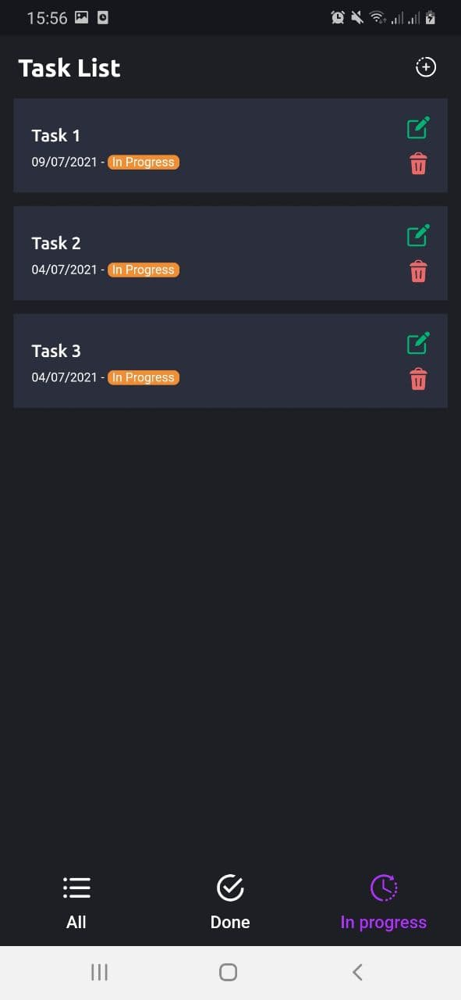
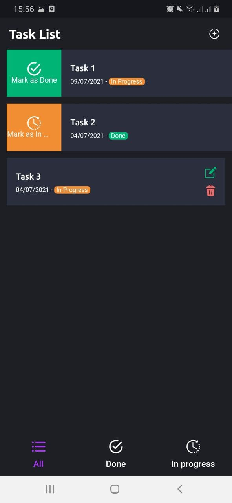
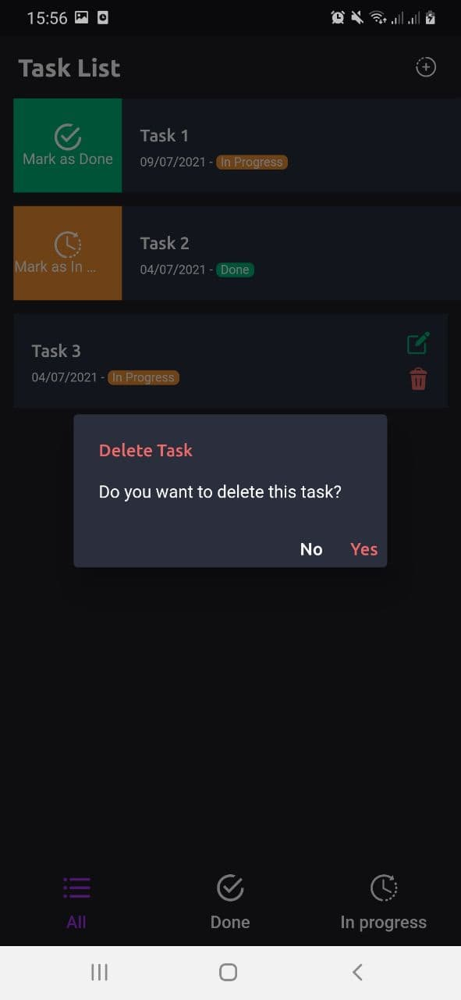

# Task List Alif
Project Language: English

Created by Bobobek Turdiyev

# Some Screenshots

<b>First Screen</b>

<b>Add Task</b>

<b>Screen that shows tasks whose status is In Progress</b>

<b>User can slide task item to the right in order to swap its status</b>

<b>Delete the task</b>

